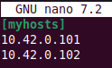
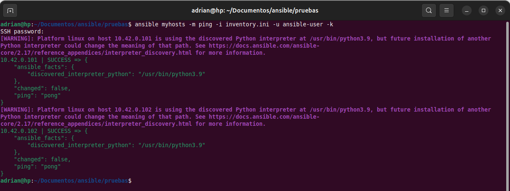

Los inventory (inventario) como ya dijimos sirven para organizar los ***managed nodes*** en ficheros centralizados que provee a Ansible de las localizaciones de red de los sistemas. Usando un archivo inventory Ansible puede gestionar varios sistemas con un solo comando. 
Para completar los siguientes pasos, necesitas la dirección IP o el fully qualified domain name (FQDN) de al menos un sistema. Para la demostración usare unas maquinas virtuales.
1. Crear un archivo llamado inventory.ini.
	`nano inventory.ini`
2. Añadimos un nuevo grupo llamado myhosts a inventory.ini y especificamos las IPs de las maquinas que queremos controlar.
	
3. Verificamos el inventario.
	`ansible-inventory -i inventory.ini --list`
4. Hacemos un ping a los equipos del inventario, siendo (usuario) sustituido por el nombre de usuario por el que accederá ansible a las maquinas vía ssh y con la opción -k le indicamos que nos pregunte por la contraseña a utilizar para dicha conexión.
	`ansible myhosts -m ping -i inventory -u (usuario) -k`
	
	>[!INFO] Nota
	>
	>También puedes utilizar las claves ssh para la conexión, simplemente añádelas al archivo /home/(usuario)/.ssh/authorized_keys

Si quieres profundizar mas en la creación de inventarios mira la [documentación oficial de ansible](https://docs.ansible.com/ansible/latest/inventory_guide/intro_inventory.html#intro-inventory) sobre como crear inventarios.