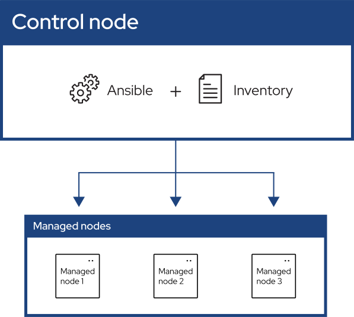

[Ansible](https://www.ansible.com) es una plataforma de software libre para la configuración y administración de múltiples ordenadores.

## Alguna información
- Autor y desarrollador: [Michael Dehaan](https://github.com/mpdehaan)
- Lanzamiento inicial: 20 de febrero de 2012
- Licencia: [GLP-3.0](https://es.wikipedia.org/wiki/GNU_General_Public_License)
- Programado principalmente en: Python
- Ultima versión estable:  [Ver aquí](https://github.com/ansible/ansible/releases)

## Empezando con Ansible
Ansible automatiza la gestión remota de múltiples sistemas.

Como se puede ver en el diagrama hay tres componentes principales:

### Conceptos de Ansible
Estos conceptos son comunes a todos los usos de Ansible. Deberías entenderlos antes de usar Ansible o leer la documentación.

- [Control node](##Control node)
- [Managed nodes](https://docs.ansible.com/ansible/latest/getting_started/basic_concepts.html#managed-nodes)
- [Inventory](https://docs.ansible.com/ansible/latest/getting_started/basic_concepts.html#inventory)
- [Playbooks](https://docs.ansible.com/ansible/latest/getting_started/basic_concepts.html#playbooks)
    - [Plays](https://docs.ansible.com/ansible/latest/getting_started/basic_concepts.html#plays)
        - [Roles](https://docs.ansible.com/ansible/latest/getting_started/basic_concepts.html#roles)
        - [Tasks](https://docs.ansible.com/ansible/latest/getting_started/basic_concepts.html#tasks)
        - [Handlers](https://docs.ansible.com/ansible/latest/getting_started/basic_concepts.html#handlers)
- [Modules](https://docs.ansible.com/ansible/latest/getting_started/basic_concepts.html#modules)
- [Plugins](https://docs.ansible.com/ansible/latest/getting_started/basic_concepts.html#plugins)
- [Collections](https://docs.ansible.com/ansible/latest/getting_started/basic_concepts.html#collections)

#### Control node

La máquina desde la que ejecutas las herramientas CLI de Ansible (`ansible-playbook`, `ansible`, `ansible-vault` y otras). Puede utilizar cualquier ordenador que cumpla los requisitos de software como nodo de control: portátiles, escritorios compartidos y servidores pueden ejecutar Ansible. También puedes ejecutar Ansible en contenedores conocidos como [Entornos de Ejecución](https://docs.ansible.com/ansible/latest/getting_started_ee/index.html#getting-started-ee-index).

Es posible utilizar varios nodos de control, pero Ansible no se coordina entre ellos, consulte `AAP` para conocer estas características.

#### Managed nodes

También denominados 'hosts', son los dispositivos de destino (servidores, dispositivos de red o cualquier ordenador) que se pretende gestionar con Ansible.

Ansible no se instala normalmente en nodos gestionados, a menos que estés usando `ansible-pull`, pero esto es raro y no es la configuración recomendada.

#### Inventory

Una lista de nodos gestionados proporcionada por una o más 'fuentes de inventario'. Tu inventario puede especificar información específica de cada nodo, como la dirección IP. También se utiliza para asignar grupos, que permiten tanto la selección de nodos en la 'Play' como la asignación masiva de variables.

Para saber más sobre el inventario, consulte la sección [Trabajar con Inventario](https://docs.ansible.com/ansible/latest/inventory_guide/intro_inventory.html#intro-inventory). A veces, un archivo fuente de inventario también se denomina 'hostfile'.

#### Playbooks

Contienen Plays (que son la unidad básica de ejecución de Ansible). Se trata tanto de un 'concepto de ejecución' como de la forma en que describimos los archivos sobre los que opera `ansible-playbook`.

Los playbooks están escritos en YAML y son fáciles de leer, escribir, compartir y entender. Para saber más sobre playbooks, consulta [Ansible playbooks.](https://docs.ansible.com/ansible/latest/playbook_guide/playbooks_intro.html#about-playbooks)

##### Plays

El contexto principal para la ejecución de Ansible, este objeto playbook asigna nodos gestionados (hosts) a tareas. El play contiene variables, roles y una lista ordenada de tareas y puede ejecutarse repetidamente. Básicamente consiste en un bucle implícito sobre los hosts y tareas signados y define cómo iterar sobre ellos.

###### Roles

Una distribución limitada de contenido reutilizable de Ansible (tasks, handlers, variables, plugins) para su uso dentro de un Play.

Para utilizar cualquier recurso Role, el propio Role debe ser importado en el Play.

###### Tasks

La definición de una 'acción' que se aplicará al 'managed node'. Puedes ejecutar una sola tarea una vez con un comando ad hoc usando `ansible` o `ansible-console` (ambos crean una Play virtual).

###### Handlers

Una forma especial de Tarea, que sólo se ejecuta cuando es notificada por una tarea previa que resultó en un estado 'cambiado'.

#### Modules

El código o binarios que Ansible copia y ejecuta en cada nodo gestionado (cuando es necesario) para llevar a cabo la acción definida en cada Tarea.

Cada módulo tiene un uso particular, desde la administración de usuarios en un tipo específico de base de datos hasta la gestión de interfaces VLAN en un tipo específico de dispositivo de red.

Puede invocar un solo módulo con una tarea, o invocar varios módulos diferentes en un playbook. Los módulos de Ansible se agrupan en colecciones. Para hacerse una idea de cuántas colecciones incluye Ansible, consulte el [índice de colecciones](https://docs.ansible.com/ansible/latest/collections/index.html#list-of-collections).

#### Plugins

Piezas de código que amplían las capacidades básicas de Ansible. Los plugins pueden controlar:
- Cómo se conecta a un nodo gestionado (plugins de conexión)
- Manipulación de datos (plugins de filtrado)
- Controlar lo que se muestra en la consola (plugins de devolución de llamada)

Ver [Trabajar con plugins](https://docs.ansible.com/ansible/latest/plugins/plugins.html#working-with-plugins) para más detalles.

#### Collections

Un formato de distribución para contenido de Ansible que puede incluir:
- Playbooks
- Roles
- Módulos
- Plugins

Puedes instalar y utilizar colecciones a través de [Ansible Galaxy](https://galaxy.ansible.com/).

**Características principales:**
- Los recursos de las colecciones pueden usarse de forma independiente
- Son componentes discretos que funcionan entre sí
- Proporcionan una forma organizada de empaquetar funcionalidades

Para obtener más información sobre las colecciones, consulte [Uso de las colecciones de Ansible](https://docs.ansible.com/ansible/latest/collections_guide/index.html#collections).
